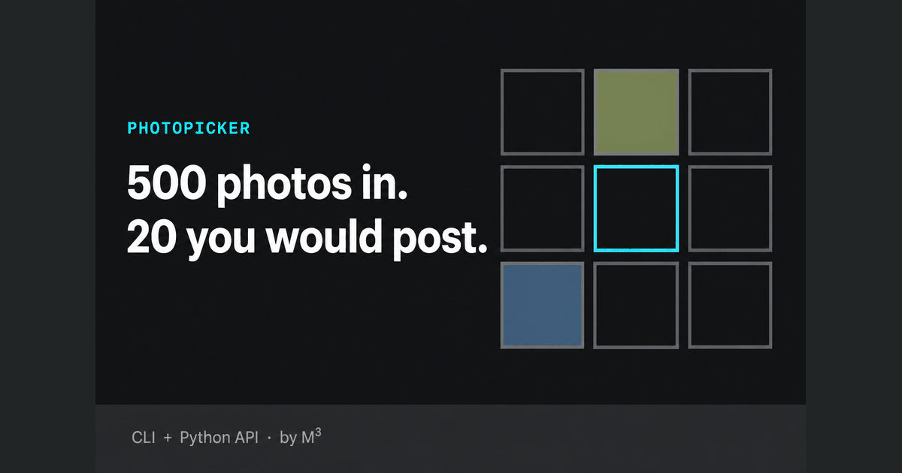
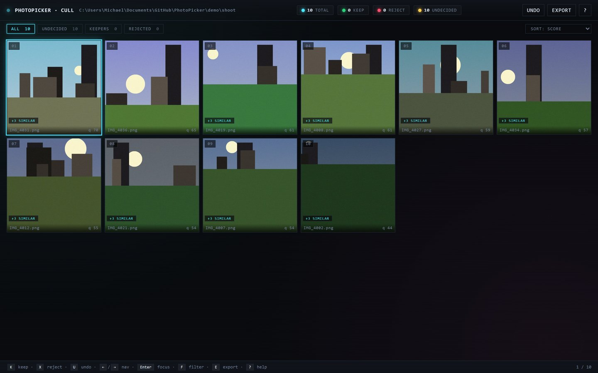
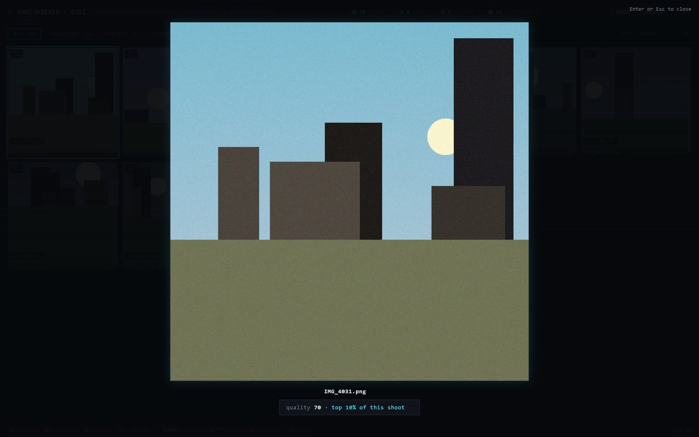

# PhotoPicker — photo culling for pipelines



Every photo-culling product on the market is a GUI fighting for the same
wedding photographer. PhotoPicker is the other thing: a **scriptable Python
library + CLI** that turns a raw folder into a curated keeper set from code —
agency site builds, real-estate feeds, batch e-commerce, CI jobs, overnight
automation. Deterministic offline pipeline, pip-installable, no GUI required
(there is a local review UI when you want eyes on it).

```python
from photopicker import pick_photos

pick = pick_photos(folder="./photos", profile_name="default")
```

Headless, in a pipeline:

```bash
# Cull 500 frames to the best 30, no UI, machine-readable result:
photopicker-cull ./shoot --top 30 --no-serve --json-out

# Copy winners for a static site build + write a manifest the frontend consumes:
photopicker-cull ./shoot --top 30 --output ./site/img --no-serve --manifest cull.json

# Hand results to Lightroom instead: star ratings embedded in the JPEG copies.
photopicker-cull ./shoot --top 30 --output ./rated --no-serve --xmp
```

## Perf (measured, `scripts/perf_1k.py`)

| Input | Result | Time |
|---|---|---|
| 500 photos | 30 keepers | **~9.5 s** |
| 1000 photos | 30 keepers | **~18 s** |
| Vision rerank | per photo | ~1.5 s (parallelized 4-wide) |

Offline numbers from a typical dev laptop (Windows, py3.10). Reproduce with
`python scripts/perf_1k.py --n 1000 --top 30`.

## Stack

Python 3.10+ · Pillow + pillow-heif (HEIC) · OpenCV (sharpness) · Click (CLI) · stdlib `http.server` (web UI) · CLIP via `transformers` (optional themed labels) · Claude Vision via `anthropic` (optional composition rerank) · MediaPipe Face Mesh (optional face/closed-eye down-rank, Apache 2.0)

## Status

**v0.14.** Cull + web UI + Vision rerank + sharpest-per-cluster + filter chips + resume + manifest export + XMP ratings + override-rate metric + opt-in face/closed-eye down-rank. **398 tests green** · ruff-clean · CI on py3.10/3.11/3.12.

## Quick start — cull a shoot

Two commands, no API key needed:

```bash
python demo/seed.py                       # 40 synthetic test photos, no camera roll needed
photopicker-cull demo/shoot --top 10      # Opens the web UI at http://127.0.0.1:8765
```





*Real captures of the web UI reviewing `demo/shoot` — the synthetic frames
`demo/seed.py` generates (fake landscapes, real pipeline).*

Real-world use:

```bash
# Point at a folder, get the 30 best in a local UI (offline; no API keys needed):
photopicker-cull ~/photos/aries_shoot_2026-07-05 --top 30

# Same, but rerank with Claude Vision on a prompt (money code — retries with
# exponential backoff on 429/network drops; see docs/DECISIONS.md § D-005):
export ANTHROPIC_API_KEY=sk-ant-...
pip install "photopicker[vision]"
photopicker-cull ~/photos/aries_shoot_2026-07-05 --top 30 \
  --prompt "best deck photos for a portfolio"
```

The UI:

- Grid of survivors, monospace + LEDs (light on the eyes, no photo-review app fatigue)
- **K** keep, **X** reject, **U** undo, **←/→** navigate, **Enter** full-size focus, **E** export, **?** help
- Focus view shows *why*: composite score, "top N% of this shoot" percentile, AI reason when reranked, and the cull reason (blurry / too small / duplicate) on pipeline rejects
- Session state persists to `.photopicker-session.json` — Ctrl+C safe
- Export button copies keepers into any folder you name; HEIC → JPG by default; originals untouched
- Export reports the override rate — how many pipeline picks you reversed — the honest accuracy metric (`scripts/override_rate.py` aggregates it across shoots)

### Cull flags

| Flag | Purpose |
|---|---|
| `--top N` | Number of keepers (default 30) |
| `--serve / --no-serve` | Open the web UI (default on unless `--output` is set) |
| `--port N` | Web UI port (default 8765) |
| `--output DIR` | Copy keepers here without opening UI |
| `--manifest PATH` | Write a JSON manifest of the cull (rank + score + capture_time + AI score) |
| `--prompt "..."` | Rerank survivors via Claude Vision on this prompt |
| `--no-ai` | Skip AI rerank even with `--prompt` |
| `--ai-max-attempts N` | Retry each Vision call up to N times on rate limits / transient failures (env `PHOTOPICKER_VISION_MAX_ATTEMPTS`) |
| `--overwrite / --no-overwrite` | Allow `--output` to write into a non-empty folder (default off — refuses to clobber) |
| `--xmp / --no-xmp` | Embed `xmp:Rating` stars (5..1 by rank) into the JPEG copies `--output` writes — Lightroom/Bridge read them; originals untouched |
| `--live-progress / --no-live-progress` | Boot the web UI first and stream cull progress into it (useful on 500+ photo folders) |
| `--sort MODE` | Order keepers by `score` (default), `capture-time`, or `name` |
| `--include-rejects` | Also surface pipeline rejects in the UI so you can rescue false positives |
| `--resume` | Reopen the saved session in FOLDER without re-running the pipeline |
| `--sharpness N` | Reject frames below this Laplacian variance (default 60) |
| `--min-long-edge N` | Reject frames whose longer edge is < N pixels (default 800) |
| `--json-out` | Print the result as JSON instead of a summary |
| `--faces / --no-faces` | Down-rank photos where the worst detected face has closed eyes (off by default — see "Face + closed-eye detection" below) |

## Install

Not on PyPI yet — the publish is queued (see `PENDING_MANUAL.md`). Until then,
from a clone:

```bash
pip install -e .              # core (cull + profiles) — dep-light, no torch
pip install -e ".[clip]"      # add CLIP semantic labels for themed profiles
pip install -e ".[vision]"    # add Claude Vision rerank for `--prompt`
pip install -e ".[faces]"     # add MediaPipe face/closed-eye down-rank for `--faces`
pip install -e ".[dev]"       # pytest + coverage + ruff
```

## Face + closed-eye detection

Opt-in signal for the general-purpose cull (`photopicker-cull ... --faces`,
or `cull(..., face_gate=True)` in code): detects faces and down-ranks a photo
if the worst detected face has closed eyes. **Off by default** — enabling it
never changes behavior for existing profiles/shoots unless you explicitly
pass the flag.

- **Model:** [MediaPipe Face Mesh](https://github.com/google/mediapipe)
  (Google), pinned `mediapipe==0.10.21` — **Apache License 2.0**, no
  research-only or non-commercial restriction, verified against the package's
  own `METADATA`/`LICENSE` at integration time. `mediapipe>=0.10.22` removed
  the offline legacy API this integration depends on in favor of a Tasks API
  that downloads model weights from Google's servers at runtime; 0.10.21
  ships the `.tflite` face-landmark model inside the wheel, so detection
  stays fully offline like the rest of this pipeline.
- **How it works:** the published Eye Aspect Ratio (EAR) technique
  (Soukupova & Cech, 2016) computed from MediaPipe's iris-refined landmarks —
  no training, no labeled dataset. A photo with no face scores neutral
  (never penalized for lacking a person); a photo with a face whose EAR is
  below the standard 0.2 blink threshold gets its composite score multiplied
  by `0.4` before ranking.
- **Enable:** `pip install "photopicker[faces]"`, then `--faces` on
  `photopicker-cull`, or `face_eye_score(path)` / `cull(..., face_gate=True)`
  from `photopicker.faces` in code.
- **Scope:** face + eye-open/closed only — not face recognition/identity, and
  not (yet) wired into the themed `aries`/`big7`/`default`/`aries-gallery`
  profiles, just the general `cull()` pipeline behind `photopicker-cull`.

`build.sh` / `build.bat` set the core install up from a clean clone. `run.sh cull ./shoot` is the one-liner operator target.

## Themed profiles (`photopicker` command)

| Profile | What it picks |
|---|---|
| `aries` | 1 before + 1 during + 1 after + top 6 others (CLIP labels the construction stage) |
| `aries-gallery` | **Full-batch curation** for portfolio detail pages: twin dedup → perceptual dedup → quality gate → CLIP phase classify → per-phase ranked lists (cap 8 each). Use this when handing raw client folders (mixed HEIC/JPG, some blurry, some near-dupes) straight to a portfolio site. |
| `big7` | splits photos into `repair` / `build` buckets, top 6 each |
| `default` | top 9 by composite quality (sharpness + exposure) |

## CLI

```bash
photopicker --folder ./photos --profile aries
photopicker --folder ./photos --profile big7 --output ./curated
photopicker --folder ./photos --profile default --json-out
```

| Flag | Purpose |
|---|---|
| `--folder, -f` | Input folder (required) |
| `--profile, -p` | One of `aries`, `big7`, `aries-gallery`, `default` (required unless `--config`) |
| `--config PATH` | Load a JSON profile config instead of a built-in profile |
| `--output, -o` | If set, copies picks into subfolders by category |
| `--benchmark` | Print WHY each photo won — base quality plus every rule's contribution |
| `--weight NAME=VALUE` | Retune a rule's weight for this run (repeatable; `0` switches a rule off) |
| `--dry-run` | Skip CLIP + skip writes — sanity-check the profile against a folder fast |
| `--json-out` | Emit the selection as JSON instead of human summary |

### Tuning a profile without editing it

`--benchmark` names the rules (`warmth`, `greenery`, `ambient-lights`, `furnished` for
aries; `people`, `clean-lines`, `finished-result`, `hero-exterior` for big7). Feed those
names back in with `--weight` to bias a specific shoot:

```bash
# A deck shot at noon with no staging: lean on greenery, ignore the golden-hour rule.
photopicker --folder ./shoot --profile aries --benchmark \
  --weight warmth=0.1 --weight greenery=0.5 --weight furnished=0
```

Bonuses still saturate at 0.75x base quality, so no override can promote a soft frame
over a sharp one. An unknown rule name is a hard error, not a silent no-op.

## Programmatic use

```python
from photopicker import pick_photos

pick = pick_photos(folder="./photos", profile_name="aries")
print(pick.summary())
for category, paths in pick.selection.categorized.items():
    print(category, [p.name for p in paths])
```

## Add a new profile

1. Create `photopicker/profiles/<site>.py`
2. Implement `select(paths, classifier) -> Selection`
3. Register at module load: `register_profile(Profile(name="<site>", select=select))`
4. Add it to `photopicker/profiles/__init__.py` imports
5. Write tests in `tests/test_profiles.py` (use the `StubClassifier` — no torch needed)

See `photopicker/profiles/aries.py` as the reference.

## Dev quick-start

```bash
pip install -e ".[dev]"
ruff check .
pytest                        # 398 tests, ~40s (7 face-detection tests skip without [faces])
pytest --cov=photopicker
```

## Why this exists

Michael's project sites currently show too many photos. PhotoPicker centralizes "pick the best N" logic so each site gets a tight, themed gallery, and adding a new site is one file + one register call.

<!-- standards-block-v1 -->
## Standards & docs

This project follows the cross-repo engineering standards. See the repo-root docs (one level up from this project):

| Doc | Purpose |
|---|---|
| `ENGINEERING_STANDARDS.md` | Principles + code quality + stack picking + Definition of Done |
| `docs/TESTING_STANDARDS.md` | Test pyramid, coverage gates |
| `docs/API_STANDARDS.md` | REST + Swagger + Postman conventions |
| `docs/OBSERVABILITY_STANDARDS.md` | Logs / metrics / traces / health / alerts |
| `docs/SECURITY_STANDARDS.md` | OWASP top 10, auth, secrets, supply chain |
| `docs/DATABASE_STANDARDS.md` | Schema, migrations, indexing |
| `docs/HOSTING_STANDARDS.md` | Hosting picks + cost ladder |
| `docs/MICROSERVICES_STANDARDS.md` | When to split, contracts, fitness function |

Project-specific docs live in this repo at the root: `BRD.md` · `TRD.md` · `RUNBOOK.md` · `ONBOARDING.md` · `CHANGELOG.md` · `CONTRIBUTING.md` · `SECURITY.md`.

ADRs live in `docs/adr/`. Postmortems live in `docs/postmortems/`.
